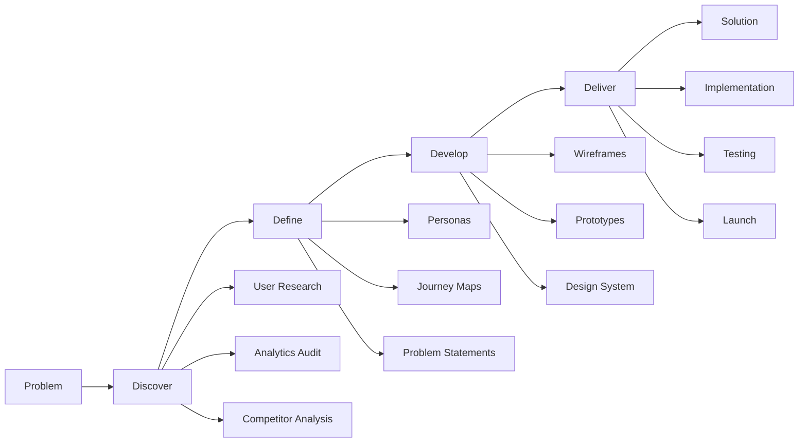

# UX Optimization Design Document

## Overview

This design document outlines a comprehensive UX optimization strategy for Mindscraft.dev, following a systematic product design methodology. The design process follows the Double Diamond approach (Discover, Define, Develop, Deliver) combined with user-centered design principles to create an exceptional user experience that drives conversions, builds trust, and showcases expertise.

## Product Design Process

### Phase 1: Discover (Research & Analysis)

#### User Research
```typescript
interface UserResearchPlan {
  // Primary Research Methods
  userInterviews: {
    participants: "10-12 potential clients (startup founders, product managers)";
    duration: "45-60 minutes each";
    focus: "pain points, decision criteria, current solutions";
    deliverable: "user insights report";
  };
  
  competitorAnalysis: {
    directCompetitors: ["agency websites in similar space"];
    indirectCompetitors: ["freelancer platforms, in-house teams"];
    analysis: "UX patterns, conversion strategies, positioning";
    deliverable: "competitive landscape report";
  };
  
  analyticsAudit: {
    currentData: "Google Analytics, heatmaps, user recordings";
    focus: "user behavior, drop-off points, popular content";
    tools: ["Hotjar", "Google Analytics", "Search Console"];
    deliverable: "current state analysis";
  };
  
  stakeholderInterviews: {
    participants: "internal team, existing clients";
    focus: "business goals, brand perception, success stories";
    deliverable: "stakeholder requirements document";
  };
}
```

#### Current State Analysis
```typescript
interface CurrentStateAudit {
  // UX Audit
  usabilityAudit: {
    heuristics: "Nielsen's 10 usability principles";
    accessibility: "WCAG 2.1 compliance check";
    mobile: "mobile usability assessment";
    deliverable: "UX audit report with severity ratings";
  };
  
  // Technical Audit
  performanceAudit: {
    tools: ["Lighthouse", "PageSpeed Insights", "WebPageTest"];
    metrics: ["Core Web Vitals", "loading times", "resource optimization"];
    deliverable: "performance optimization roadmap";
  };
  
  // Content Audit
  contentAudit: {
    inventory: "all existing content and assets";
    quality: "relevance, accuracy, engagement";
    gaps: "missing content for user journeys";
    deliverable: "content strategy recommendations";
  };
}
```

### Phase 2: Define (Synthesis & Strategy)

#### User Personas & Journey Mapping
```typescript
interface DefinePhase {
  // Persona Development
  userPersonas: {
    primary: "Startup Founder (Sarah)";
    secondary: "Product Manager (Mike)";
    tertiary: "Marketing Director (Lisa)";
    
    attributes: {
      demographics: "age, role, company size";
      psychographics: "motivations, frustrations, goals";
      behaviors: "research patterns, decision process";
      technology: "device usage, platform preferences";
    };
    
    deliverable: "detailed persona profiles with empathy maps";
  };
  
  // Journey Mapping
  userJourneys: {
    awareness: "first touch point to website visit";
    consideration: "evaluating services and capabilities";
    decision: "choosing Mindscraft vs competitors";
    onboarding: "initial project kickoff";
    advocacy: "becoming a referral source";
    
    touchpoints: "all interaction points";
    emotions: "user feelings at each stage";
    painPoints: "friction and obstacles";
    opportunities: "improvement possibilities";
    
    deliverable: "comprehensive journey maps";
  };
  
  // Problem Definition
  problemStatements: {
    format: "How might we...";
    examples: [
      "How might we help startup founders quickly assess our capabilities?",
      "How might we build trust with first-time visitors?",
      "How might we streamline the project inquiry process?"
    ];
    prioritization: "impact vs effort matrix";
    deliverable: "prioritized problem statements";
  };
}
```

#### Information Architecture
```typescript
interface InformationArchitecture {
  // Card Sorting
  cardSorting: {
    method: "hybrid (open + closed)";
    participants: "8-10 target users";
    content: "all website sections and features";
    deliverable: "optimal content organization";
  };
  
  // Site Mapping
  siteMap: {
    structure: "hierarchical organization";
    navigation: "primary, secondary, utility";
    relationships: "content connections and cross-links";
    deliverable: "visual site map";
  };
  
  // User Flow Diagrams
  userFlows: {
    criticalPaths: [
      "homepage → services → contact",
      "homepage → portfolio → case study → contact",
      "blog → related services → contact"
    ];
    decisionPoints: "user choices and branching";
    exitPoints: "potential abandonment areas";
    deliverable: "detailed user flow diagrams";
  };
}
```

### Phase 3: Develop (Design & Prototyping)

#### Design System Development
```typescript
interface DesignSystemProcess {
  // Visual Design Language
  brandAlignment: {
    colorPalette: "extract and expand from existing logo";
    typography: "hierarchy and readability optimization";
    iconography: "consistent visual language";
    imagery: "photography and illustration style";
    deliverable: "brand guidelines document";
  };
  
  // Component Library
  designSystem: {
    atoms: "buttons, inputs, icons, colors, typography";
    molecules: "cards, forms, navigation items";
    organisms: "headers, footers, content sections";
    templates: "page layouts and structures";
    deliverable: "Figma component library";
  };
  
  // Design Tokens
  designTokens: {
    spacing: "consistent spacing scale";
    colors: "semantic color system";
    typography: "font sizes, weights, line heights";
    shadows: "elevation system";
    deliverable: "design token documentation";
  };
}
```

#### Wireframing & Prototyping
```typescript
interface PrototypingProcess {
  // Low-Fidelity Wireframes
  wireframes: {
    tool: "Figma or Sketch";
    fidelity: "grayscale, basic layout";
    pages: "all key pages and states";
    annotations: "functionality and behavior notes";
    deliverable: "complete wireframe set";
  };
  
  // High-Fidelity Mockups
  mockups: {
    tool: "Figma";
    fidelity: "pixel-perfect, branded";
    responsive: "mobile, tablet, desktop versions";
    states: "default, hover, active, error states";
    deliverable: "high-fidelity design files";
  };
  
  // Interactive Prototypes
  prototypes: {
    tool: "Figma or Principle";
    interactions: "navigation, animations, micro-interactions";
    scenarios: "key user journeys";
    testing: "internal validation before development";
    deliverable: "clickable prototypes";
  };
}
```

#### Design Validation
```typescript
interface DesignValidation {
  // Design Reviews
  internalReviews: {
    stakeholders: "team leads, developers, content creators";
    criteria: "brand alignment, feasibility, user needs";
    iterations: "incorporate feedback and refine";
    deliverable: "approved design specifications";
  };
  
  // User Testing
  usabilityTesting: {
    method: "moderated remote sessions";
    participants: "5-8 target users";
    tasks: "key user scenarios";
    metrics: "task completion, time, errors, satisfaction";
    deliverable: "usability testing report";
  };
  
  // Accessibility Review
  accessibilityAudit: {
    standards: "WCAG 2.1 AA compliance";
    tools: ["Stark", "Colour Contrast Analyser"];
    testing: "keyboard navigation, screen readers";
    deliverable: "accessibility compliance report";
  };
}
```

### Phase 4: Deliver (Implementation & Launch)

#### Design Handoff
```typescript
interface DesignHandoff {
  // Developer Specifications
  designSpecs: {
    measurements: "precise spacing, sizing, positioning";
    assets: "optimized images, icons, graphics";
    interactions: "animation specifications, timing";
    responsive: "breakpoint behaviors";
    deliverable: "developer-ready specifications";
  };
  
  // Style Guide
  implementationGuide: {
    components: "HTML/CSS component examples";
    patterns: "reusable design patterns";
    guidelines: "do's and don'ts";
    deliverable: "front-end style guide";
  };
  
  // Quality Assurance
  designQA: {
    reviews: "design implementation reviews";
    testing: "cross-browser, cross-device testing";
    refinements: "pixel-perfect adjustments";
    deliverable: "QA-approved implementation";
  };
}
```

## Design Methodology Framework

### Double Diamond Process


### Design Thinking Principles
```typescript
interface DesignPrinciples {
  userCentered: "all decisions based on user needs and behaviors";
  dataInformed: "validate assumptions with research and analytics";
  iterative: "continuous testing and refinement";
  collaborative: "cross-functional team involvement";
  accessible: "inclusive design for all users";
  performant: "optimize for speed and efficiency";
  scalable: "design system that grows with the business";
}
```

## Architecture

### Information Architecture

```
Homepage (Landing Hub)
├── Hero Section (Value Proposition + CTA)
├── Social Proof (Client Logos + Testimonials)
├── Services Overview (Quick Access)
├── Featured Work (Case Studies)
├── About Preview (Trust Building)
├── Blog Preview (Thought Leadership)
└── Contact CTA (Conversion)

Services Section
├── Service Categories (UX, Development, AI, Startup)
├── Process Visualization
├── Pricing Transparency
├── Case Study Integration
└── Consultation Booking

Portfolio/Work Section
├── Project Filtering (Industry, Technology, Type)
├── Case Study Deep Dives
├── Client Results & Metrics
├── Process Documentation
└── Related Services

About Section
├── Team Expertise
├── Company Values
├── Certifications & Awards
├── Client Testimonials
└── Culture & Process

Blog Section
├── Content Categories
├── Search & Filtering
├── Related Content
├── Author Profiles
└── Newsletter Signup

Contact Section
├── Multiple Contact Methods
├── Calendar Integration
├── Project Brief Form
├── FAQ Section
└── Response Expectations
```

### User Journey Mapping

#### Primary User Personas

1. **Startup Founder** (Primary)
   - Goals: Find reliable development partner, understand costs, see relevant experience
   - Pain Points: Limited budget, tight timelines, need for expertise validation
   - Journey: Homepage → Services → Portfolio → Contact

2. **Product Manager** (Secondary)
   - Goals: Evaluate technical capabilities, assess team expertise, compare options
   - Pain Points: Technical complexity, team coordination, quality assurance
   - Journey: Homepage → About → Portfolio → Blog → Contact

3. **Marketing Director** (Tertiary)
   - Goals: Find UX expertise, understand process, see marketing-focused results
   - Pain Points: ROI measurement, brand consistency, user acquisition
   - Journey: Services → Portfolio → Blog → Contact

## Components and Interfaces

### Enhanced Navigation System

```typescript
interface NavigationComponent {
  // Sticky header with smart hiding
  header: {
    logo: LogoComponent;
    navigation: MainNavigation;
    cta: BookCallButton;
    mobileMenu: MobileMenuOverlay;
  };
  
  // Breadcrumb system
  breadcrumbs: {
    showOn: ['services', 'portfolio', 'blog', 'about'];
    structure: 'Home > Section > Page';
    schema: BreadcrumbSchema;
  };
  
  // Footer with comprehensive links
  footer: {
    companyInfo: CompanyDetails;
    serviceLinks: ServiceNavigation;
    resourceLinks: ResourceNavigation;
    socialProof: SocialLinks;
    newsletter: NewsletterSignup;
  };
}
```

### Conversion-Optimized Components

#### Hero Section Enhancement
```typescript
interface HeroSection {
  headline: {
    primary: "Transform Your Digital Vision Into Reality";
    secondary: "AI-Powered Web Development & UX Design";
    emphasis: "Launch Faster, Scale Smarter";
  };
  
  valueProposition: {
    bullets: [
      "90% faster development with AI assistance",
      "Proven track record with 50+ successful launches",
      "End-to-end service from concept to scale"
    ];
  };
  
  ctaButtons: {
    primary: {
      text: "Start Your Project";
      action: "scroll-to-contact";
      tracking: "hero-primary-cta";
    };
    secondary: {
      text: "View Our Work";
      action: "navigate-to-portfolio";
      tracking: "hero-secondary-cta";
    };
  };
  
  socialProof: {
    clientLogos: ClientLogoCarousel;
    testimonialPreview: FeaturedTestimonial;
    metrics: [
      { label: "Projects Delivered", value: "50+" },
      { label: "Client Satisfaction", value: "98%" },
      { label: "Average Launch Time", value: "6 weeks" }
    ];
  };
}
```

#### Trust Building Components
```typescript
interface TrustElements {
  testimonials: {
    format: "video + text";
    placement: ["homepage", "services", "about"];
    rotation: "dynamic based on page context";
    schema: TestimonialSchema;
  };
  
  caseStudies: {
    preview: CaseStudyCard;
    fullView: CaseStudyPage;
    metrics: ProjectMetrics;
    clientQuotes: ClientFeedback;
  };
  
  certifications: {
    display: BadgeGrid;
    verification: LinkedCredentials;
    placement: "about page + footer";
  };
  
  teamCredentials: {
    profiles: TeamMemberCard;
    expertise: SkillMatrix;
    experience: ExperienceTimeline;
  };
}
```

### Mobile-First Responsive Design

#### Breakpoint Strategy
```css
/* Mobile First Approach */
.responsive-container {
  /* Base: Mobile (320px+) */
  padding: 1rem;
  
  /* Small Mobile (375px+) */
  @media (min-width: 375px) {
    padding: 1.25rem;
  }
  
  /* Large Mobile (425px+) */
  @media (min-width: 425px) {
    padding: 1.5rem;
  }
  
  /* Tablet (768px+) */
  @media (min-width: 768px) {
    padding: 2rem;
    display: grid;
    grid-template-columns: 1fr 1fr;
  }
  
  /* Desktop (1024px+) */
  @media (min-width: 1024px) {
    padding: 3rem;
    grid-template-columns: 1fr 2fr 1fr;
  }
  
  /* Large Desktop (1440px+) */
  @media (min-width: 1440px) {
    max-width: 1400px;
    margin: 0 auto;
  }
}
```

#### Touch-Friendly Interface
```typescript
interface TouchOptimization {
  minimumTouchTarget: "44px x 44px";
  spacing: "8px minimum between interactive elements";
  gestures: {
    swipe: "portfolio navigation, testimonial carousel";
    pinchZoom: "case study images, portfolio previews";
    pullToRefresh: "blog listing, portfolio grid";
  };
  
  feedback: {
    haptic: "button presses, form submissions";
    visual: "button states, loading indicators";
    audio: "optional success sounds";
  };
}
```

## Data Models

### User Interaction Tracking
```typescript
interface UserSession {
  sessionId: string;
  timestamp: Date;
  userAgent: string;
  referrer: string;
  
  pageViews: PageView[];
  interactions: UserInteraction[];
  conversionEvents: ConversionEvent[];
  
  // UX Metrics
  timeOnSite: number;
  bounceRate: boolean;
  scrollDepth: number;
  clickHeatmap: HeatmapData;
}

interface UserInteraction {
  type: 'click' | 'scroll' | 'hover' | 'form_focus' | 'video_play';
  element: string;
  timestamp: Date;
  coordinates?: { x: number; y: number };
  value?: string;
}

interface ConversionEvent {
  type: 'contact_form' | 'calendar_booking' | 'newsletter_signup' | 'download';
  timestamp: Date;
  source: string;
  value?: number;
}
```

### Content Management Schema
```typescript
interface ContentModel {
  // Case Studies
  caseStudy: {
    id: string;
    title: string;
    client: ClientInfo;
    challenge: string;
    solution: string;
    results: ProjectMetrics;
    technologies: Technology[];
    images: MediaAsset[];
    testimonial?: Testimonial;
    relatedServices: Service[];
  };
  
  // Blog Posts
  blogPost: {
    id: string;
    title: string;
    slug: string;
    excerpt: string;
    content: string;
    author: TeamMember;
    category: BlogCategory;
    tags: string[];
    publishDate: Date;
    readTime: number;
    seoMetadata: SEOData;
  };
  
  // Team Members
  teamMember: {
    id: string;
    name: string;
    role: string;
    bio: string;
    expertise: string[];
    certifications: Certification[];
    socialLinks: SocialLink[];
    profileImage: MediaAsset;
  };
}
```

## Error Handling

### User Experience Error States

#### Progressive Error Handling
```typescript
interface ErrorHandling {
  // Network Errors
  networkError: {
    detection: "connection timeout, failed requests";
    fallback: "cached content, offline message";
    recovery: "retry mechanism, background sync";
  };
  
  // Form Validation
  formErrors: {
    realTime: "field-level validation on blur";
    submission: "comprehensive validation before submit";
    recovery: "clear error messages, suggested fixes";
  };
  
  // Content Loading
  contentErrors: {
    images: "progressive loading, fallback images";
    videos: "poster frames, alternative content";
    apis: "skeleton screens, cached data";
  };
  
  // 404 Handling
  notFound: {
    customPage: "branded 404 with navigation";
    suggestions: "related content, search functionality";
    tracking: "log broken links for fixing";
  };
}
```

#### Graceful Degradation Strategy
```typescript
interface GracefulDegradation {
  javascript: {
    disabled: "core functionality still works";
    fallbacks: "server-side rendering, basic forms";
  };
  
  css: {
    unsupported: "readable typography, basic layout";
    fallbacks: "system fonts, standard colors";
  };
  
  images: {
    loading: "alt text, placeholder colors";
    failed: "fallback images, descriptive text";
  };
  
  animations: {
    reducedMotion: "respect user preferences";
    performance: "disable on slow devices";
  };
}
```

## Testing Strategy

### A/B Testing Framework

#### Conversion Optimization Tests
```typescript
interface ABTestingPlan {
  heroSection: {
    variants: [
      "current design",
      "video background",
      "animated illustrations",
      "client testimonial focus"
    ];
    metrics: ["conversion rate", "time on page", "scroll depth"];
    duration: "2 weeks minimum";
  };
  
  ctaButtons: {
    variants: [
      "Get Started vs Start Your Project",
      "Book a Call vs Schedule Consultation",
      "View Work vs See Our Portfolio"
    ];
    metrics: ["click-through rate", "conversion rate"];
    duration: "1 week minimum";
  };
  
  pricingDisplay: {
    variants: [
      "transparent pricing",
      "contact for quote",
      "starting from pricing"
    ];
    metrics: ["contact form submissions", "bounce rate"];
    duration: "3 weeks minimum";
  };
}
```

### Performance Testing

#### Core Web Vitals Optimization
```typescript
interface PerformanceTargets {
  loadingPerformance: {
    LCP: "< 2.5 seconds"; // Largest Contentful Paint
    FID: "< 100 milliseconds"; // First Input Delay
    CLS: "< 0.1"; // Cumulative Layout Shift
  };
  
  mobilePerformance: {
    3G: "< 3 seconds first meaningful paint";
    4G: "< 1.5 seconds first meaningful paint";
    WiFi: "< 1 second first meaningful paint";
  };
  
  optimizationStrategies: {
    images: "WebP format, lazy loading, responsive images";
    fonts: "font-display: swap, preload critical fonts";
    javascript: "code splitting, tree shaking, compression";
    css: "critical CSS inlining, unused CSS removal";
  };
}
```

### Usability Testing

#### User Testing Protocol
```typescript
interface UsabilityTesting {
  testScenarios: [
    {
      task: "Find information about UX design services";
      success: "user reaches services page within 30 seconds";
      metrics: ["task completion rate", "time to completion", "error rate"];
    },
    {
      task: "Book a consultation call";
      success: "user completes calendar booking";
      metrics: ["conversion rate", "abandonment points", "user satisfaction"];
    },
    {
      task: "Find a relevant case study";
      success: "user views complete case study";
      metrics: ["findability", "engagement time", "related content clicks"];
    }
  ];
  
  testingMethods: {
    moderated: "1-on-1 sessions with target users";
    unmoderated: "remote testing with task recordings";
    guerrilla: "quick feedback sessions";
    analytics: "behavior flow analysis";
  };
  
  frequency: "monthly usability sessions";
  participants: "5-8 users per test cycle";
}
```

## Implementation Phases

### Phase 1: Foundation (Weeks 1-2)
- Performance optimization and Core Web Vitals
- Mobile-first responsive design implementation
- Basic analytics and tracking setup
- Error handling and fallback systems

### Phase 2: Conversion Optimization (Weeks 3-4)
- Hero section redesign with A/B testing
- Trust element integration (testimonials, case studies)
- Contact form optimization and calendar integration
- Social proof implementation

### Phase 3: Content Enhancement (Weeks 5-6)
- Portfolio/case study redesign
- Blog section optimization
- Team/about page enhancement
- SEO optimization and schema markup

### Phase 4: Advanced Features (Weeks 7-8)
- Personalization based on user behavior
- Advanced analytics and heatmap integration
- Chatbot or live chat implementation
- Lead nurturing automation

### Phase 5: Testing & Optimization (Ongoing)
- Continuous A/B testing
- User feedback collection and implementation
- Performance monitoring and optimization
- Conversion rate optimization based on data

## Success Metrics

### Primary KPIs
- **Conversion Rate**: Target 5% increase (contact form submissions + calendar bookings)
- **Page Load Speed**: All pages < 2.5s LCP on mobile
- **User Engagement**: 25% increase in average session duration
- **Mobile Experience**: 90+ mobile usability score

### Secondary KPIs
- **Bounce Rate**: Reduce by 15%
- **Lead Quality**: Increase qualified leads by 30%
- **Content Engagement**: 40% increase in blog engagement
- **Trust Metrics**: Increase testimonial interaction by 50%

### Technical Metrics
- **Accessibility**: WCAG 2.1 AA compliance (100%)
- **Performance**: Lighthouse score 90+ across all categories
- **SEO**: Core Web Vitals passing for all pages
- **Error Rate**: < 1% JavaScript errors